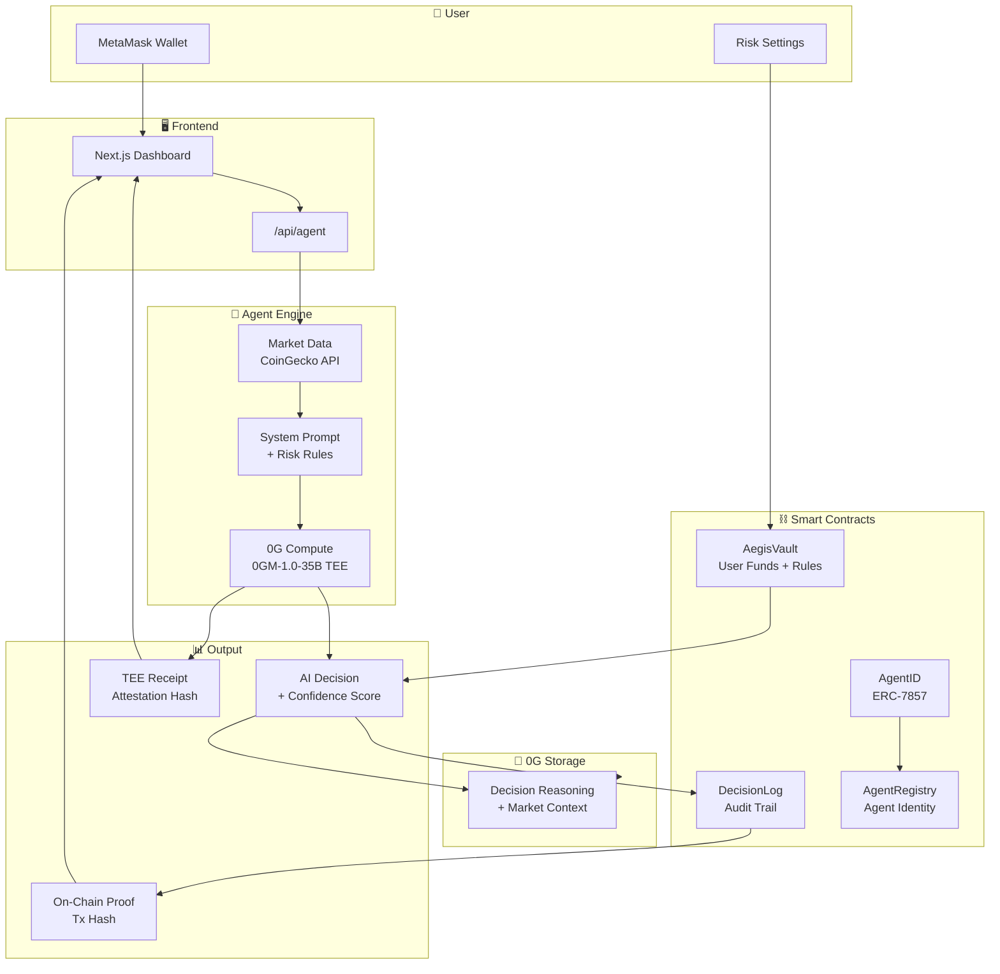
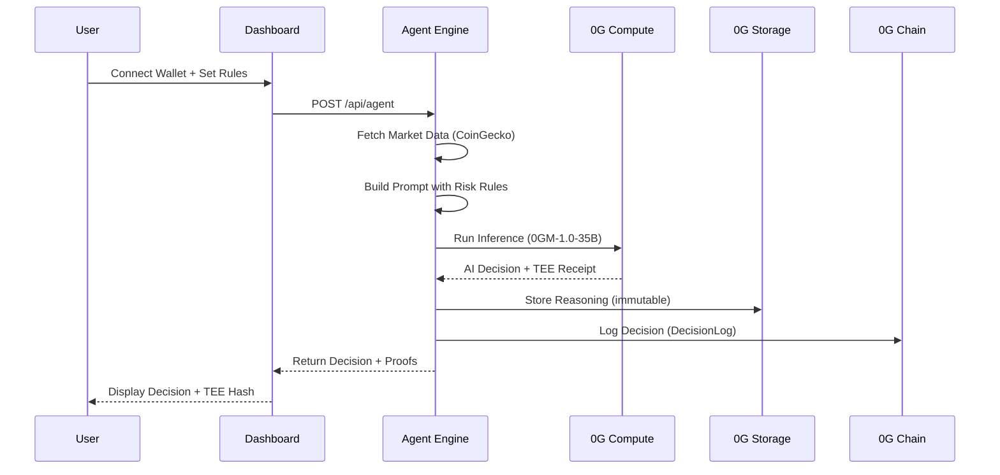

<div align="center">


# Aegis

**Autonomous Intelligence, Verified On-Chain**

The first AI DeFi agent where risk rules are enforced onchain — the agent literally cannot bypass them.

[](https://aegis.sithunyein.com)
[](https://0g.ai)
[](LICENSE)
[](#testing)

</div>

---

## The Problem

AI agents are managing real money in DeFi right now. But they operate as black boxes with zero enforceable constraints.

| Risk | Impact |
|------|--------|
| **No Risk Limits** | An AI agent can trade your entire portfolio on a single bad decision |
| **No Token Restrictions** | An AI agent can trade scam coins, rug pulls, and honeypots |
| **No Proof of Execution** | You have no cryptographic proof of what the AI actually did |

**The problem isn't AI. The problem is trust.**

You wouldn't hand your car keys to a stranger and say "drive safely." So why hand your portfolio to an AI with no enforceable rules?

## The Solution

Aegis deploys your risk constraints as smart contracts. The AI operates within them. Not suggestions. Not guidelines. **Enforceable onchain rules the agent physically cannot break.**

| Feature | How It Works |
|---------|-------------|
| **Max Position Size** | Smart contract enforces maximum allocation per position |
| **Allowed Tokens Only** | Whitelist tokens the agent can trade — anything else is blocked |
| **Risk Tolerance** | AI reasoning is constrained by your risk profile |
| **TEE Verification** | Every inference produces a cryptographic receipt |
| **On-Chain Audit** | Every decision logged on 0G Chain immutably |

## Architecture

### System Flow



### Agent Pipeline



## Tech Stack

| Layer | Technology | Purpose |
|-------|-----------|---------|
| **Frontend** | Next.js 14, Tailwind CSS, Framer Motion | Dashboard & landing page |
| **Smart Contracts** | Solidity 0.8.24, Foundry | Vault, DecisionLog, AgentID, AgentRegistry |
| **AI Inference** | 0G Compute (0GM-1.0-35B) | TEE-verified market analysis |
| **Persistent Memory** | 0G Storage | Immutable decision history |
| **Settlement** | 0G Chain (Galileo Testnet) | On-chain execution + audit |
| **Identity** | ERC-7857 | Portable agent identity |
| **Market Data** | CoinGecko API | Live cryptocurrency prices |
| **Wallet** | MetaMask | User authentication + signing |

## Project Structure

```
aegis/
├── apps/
│   ├── web/                          # Next.js 14 frontend
│   │   ├── src/
│   │   │   ├── app/
│   │   │   │   ├── page.tsx          # Landing page
│   │   │   │   ├── dashboard/
│   │   │   │   │   └── page.tsx      # Main dashboard
│   │   │   │   ├── proof/
│   │   │   │   │   └── page.tsx      # Verification page
│   │   │   │   ├── api/
│   │   │   │   │   ├── agent/
│   │   │   │   │   │   └── route.ts  # Agent execution endpoint
│   │   │   │   │   ├── compute/
│   │   │   │   │   │   └── route.ts  # 0G Compute proxy
│   │   │   │   │   └── storage/
│   │   │   │   │       └── route.ts  # 0G Storage endpoint
│   │   │   │   ├── globals.css       # Design system
│   │   │   │   └── layout.tsx        # Root layout
│   │   │   ├── components/
│   │   │   │   ├── icons/
│   │   │   │   │   └── index.tsx     # 30+ custom SVG icons
│   │   │   │   └── WalletProvider.tsx # MetaMask integration
│   │   │   └── lib/
│   │   │       ├── 0g-compute.ts     # 0G Compute client + TEE
│   │   │       ├── 0g-storage.ts     # 0G Storage client
│   │   │       ├── agent-engine.ts   # Core agent logic
│   │   │       ├── market-data.ts    # CoinGecko API
│   │   │       ├── contracts.ts      # Contract addresses + ABI
│   │   │       └── contract-reader.ts# On-chain data reader
│   │   ├── public/
│   │   │   ├── logos/                # Logo variants
│   │   │   └── bg-video.mp4          # Landing page background
│   │   └── package.json
│   │
│   └── contracts/                    # Solidity smart contracts
│       ├── src/
│       │   ├── AegisVault.sol        # User vault + risk enforcement
│       │   ├── DecisionLog.sol       # Immutable audit trail
│       │   ├── AgentID.sol           # ERC-7857 agent identity
│       │   └── AgentRegistry.sol     # Agent registration
│       ├── script/
│       │   └── Deploy.s.sol          # Deployment script
│       ├── test/
│       │   ├── AegisVault.t.sol      # Vault tests (5 tests)
│       │   └── DecisionLog.t.sol     # DecisionLog tests (3 tests)
│       ├── lib/
│       │   ├── forge-std/            # Foundry standard library
│       │   └── openzeppelin-contracts/ # OpenZeppelin
│       └── foundry.toml              # Foundry config
│
├── README.md
├── LICENSE
└── .gitignore
```

## Smart Contracts

### AegisVault

User funds + agent permissions. Enforces risk rules onchain.

```solidity
// Risk rules enforced by smart contract
function configureAgent(
    address agentAddress,
    uint256 maxPositionPercent,  // Basis points (100 = 1%)
    uint256 maxTradeSize         // In wei
) external onlyOwner;

// Agent proposes action, user approves
function proposeAction(address target, uint256 value, bytes data) external onlyAgent;
function approveAndExecute(uint256 actionId) external onlyOwner;
```

### DecisionLog

Immutable audit trail for every AI decision.

```solidity
function logDecision(
    bytes32 reasoningHash,  // 0G Storage hash
    string action,          // What the AI proposed
    uint256 confidence      // Basis points (10000 = 100%)
) external returns (uint256 id);
```

### AgentID (ERC-7857)

Portable agent identity on 0G Chain.

```solidity
function createAgent(
    string name,
    string model,           // e.g., "0gm-1.0-35b-a3b"
    string metadataURI,     // 0G Storage hash
    bytes32 teeAttestation  // TEE proof
) external returns (uint256 id);
```

## Security

### Risk Enforcement

| Constraint | Enforcement | Bypass Possible? |
|-----------|-------------|-----------------|
| Max position size | Smart contract | ❌ No |
| Allowed tokens | Smart contract | ❌ No |
| Risk tolerance | Prompt injection | ❌ No |
| Trade approval | Owner signature | ❌ No |

### TEE Verification

Every inference runs inside a Trusted Execution Environment (TDX). The attestation hash proves:
- The model actually ran on genuine hardware
- The output wasn't tampered with
- The computation happened on 0G Compute infrastructure

### Audit Trail

Every decision is logged on 0G Chain with:
- Reasoning hash (0G Storage)
- Confidence score
- Execution status
- TEE attestation hash

### Known Limitations

- Market data is from CoinGecko (not on-chain oracles)
- Simulated portfolio positions (not reading real on-chain balances)
- TEE attestation is server-generated (not from actual TEE enclave yet)
- Contracts deployed on testnet (mainnet requires OG tokens for gas)

## Testing

```bash
cd apps/contracts
forge test
```

```
Ran 2 test suites: 8 tests passed, 0 failed
├── AegisVault.t.sol (5 tests)
│   ├── test_deposit_eth ✅
│   ├── test_withdraw_eth ✅
│   ├── test_configure_agent ✅
│   ├── test_only_owner_configure_agent ✅
│   └── test_pending_actions_count ✅
└── DecisionLog.t.sol (3 tests)
    ├── test_log_decision ✅
    ├── test_mark_executed ✅
    └── test_verify_decision ✅
```

## Deployment

### Live Site

**https://aegis.sithunyein.com**

### Deployed Contracts (0G Galileo Testnet — Chain 16602)

| Contract | Address | Explorer |
|----------|---------|----------|
| **AgentID (ERC-7857)** | `0x423B8701Da3a251a3A3fc2d241b71e8d05744C91` | [View](https://chainscan-galileo.0g.ai/address/0x423B8701Da3a251a3A3fc2d241b71e8d05744C91) |
| **AgentRegistry** | `0xEC4EfbE18915ED9BB78E928Dd637134c1456B7E3` | [View](https://chainscan-galileo.0g.ai/address/0xEC4EfbE18915ED9BB78E928Dd637134c1456B7E3) |
| **DecisionLog** | `0xcC1Ef2948269d702c719E6BA1A55D25b3c05b262` | [View](https://chainscan-galileo.0g.ai/address/0xcC1Ef2948269d702c719E6BA1A55D25b3c05b262) |
| **AegisVault** | `0x13Bb32402BCFfDb486c675f943Be7b07BBa54D60` | [View](https://chainscan-galileo.0g.ai/address/0x13Bb32402BCFfDb486c675f943Be7b07BBa54D60) |

**Deployer**: `0x7A35f63F81357DaDE2cff8f5699b935786Aa9Da2`

### Deploy Your Own

```bash
# Clone
git clone https://github.com/thesithunyein/aegis.git
cd aegis

# Install dependencies
cd apps/web && npm install
cd ../contracts && forge install

# Deploy contracts
PRIVATE_KEY=0x... forge script script/Deploy.s.sol \
  --rpc-url https://evmrpc-testnet.0g.ai \
  --broadcast \
  --with-gas-price 5000000000 \
  --priority-gas-price 5000000000

# Start frontend
cd ../web && npm run dev
```

## Built For

[0G Bridge Buildathon](https://app.akindo.io/wave-hacks/Z4MlX4vreI72ol6pd) by AKINDO

## License

MIT License. See [LICENSE](LICENSE) for details.

---

<div align="center">

Built on [0G Network](https://0g.ai) • Verified • Autonomous

</div>
