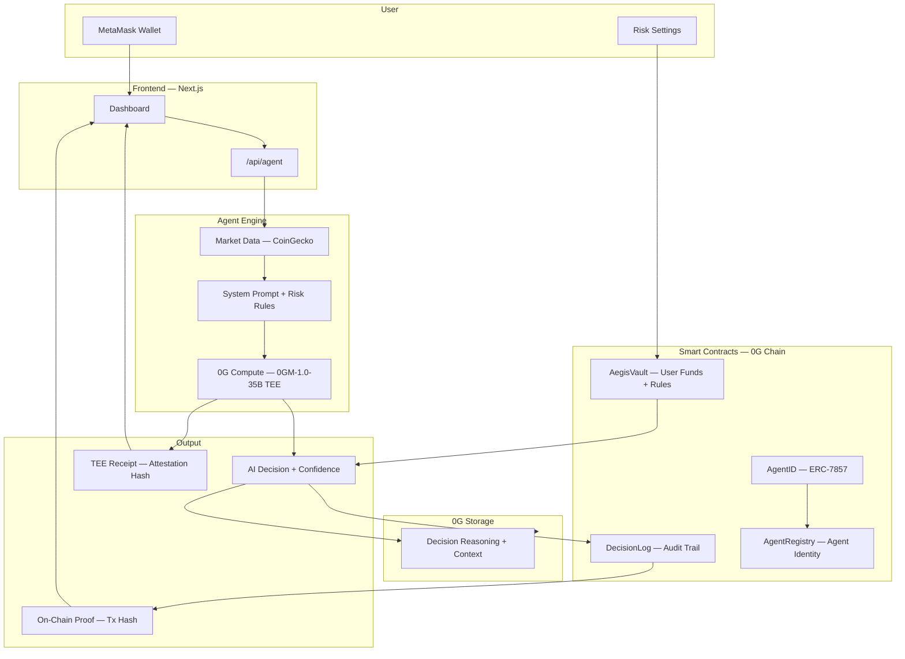
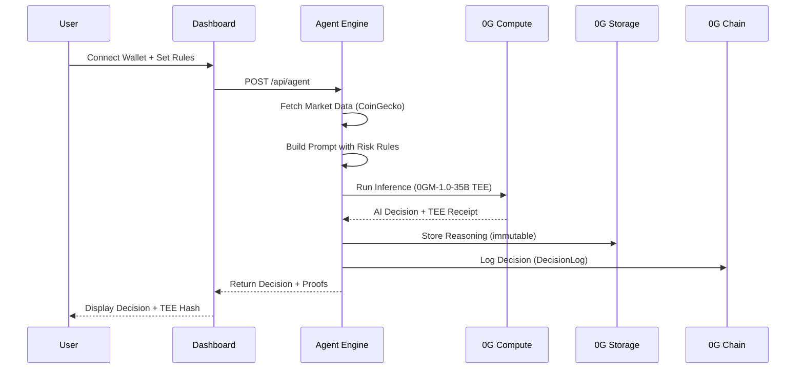

<div align="center">


# Aegis

### Your AI. Your Rules. Verified On-Chain.

**The first AI DeFi agent where risk rules are enforced as smart contracts. The agent literally cannot break them. Every decision has a cryptographic TEE receipt.**

[](https://aegis.sithunyein.com)
[](https://github.com/thesithunyein/aegis)
[](https://0g.ai)
[](LICENSE)
[](#testing)

<br />

[Demo Video](https://youtu.be/wcgS40O2iHY) • [Live App](https://aegis.sithunyein.com) • [Submit to 0G Bridge Buildathon](https://app.akindo.io/wave-hacks/Z4MlX4vreI72ol6pd)

</div>

---

## Why Aegis?

AI agents are managing real money in DeFi right now. They can trade your portfolio, ignore your risk limits, buy scam tokens, and you have no proof of what they did.

**The problem isn't AI. The problem is trust.**

| What Others Do | What Aegis Does |
|----------------|-----------------|
| AI decides everything | You set rules in smart contracts |
| "Trust me, I'm an AI" | Every decision has a TEE receipt |
| No audit trail | Every action logged on 0G Chain |
| Black box decisions | Transparent reasoning + on-chain proof |
| Suggestions, not rules | Enforceable constraints the AI cannot bypass |

**Aegis is not another AI trading bot. It is enforceable on-chain risk for AI agents.**

---

## How It Works

```
You set rules → AI operates within them → Every decision verified → Rules enforced on-chain
```

| Step | What Happens | Where |
|------|-------------|-------|
| **1. Connect** | Link your MetaMask wallet | Dashboard |
| **2. Configure** | Set max position, risk tolerance, allowed tokens | Smart Contract |
| **3. Run Agent** | AI analyzes market in real time | 0G Compute (TEE) |
| **4. Decision** | Get action + confidence + reasoning | Dashboard |
| **5. Verify** | Check TEE attestation hash | On-Chain |

---

## Architecture

### System Overview



### Agent Pipeline



---

## Tech Stack

| Layer | Technology | Purpose |
|-------|-----------|---------|
| **Frontend** | Next.js 14, Tailwind CSS, Framer Motion | Dashboard + landing page |
| **Smart Contracts** | Solidity 0.8.24, Foundry, OpenZeppelin | Vault, DecisionLog, AgentID, AgentRegistry |
| **AI Inference** | 0G Compute (0GM-1.0-35B) | TEE-verified market analysis |
| **Persistent Memory** | 0G Storage | Immutable decision history |
| **Settlement** | 0G Chain (Galileo Testnet) | On-chain execution + audit |
| **Identity** | ERC-7857 | Portable agent identity |
| **Market Data** | CoinGecko API | Live cryptocurrency prices |
| **Wallet** | MetaMask, wagmi, viem | User authentication + signing |

---

## Smart Contracts

### AegisVault

User funds + agent permissions. Enforces risk rules onchain.

```solidity
// Risk rules enforced by smart contract
function configureAgent(
    address agentAddress,
    uint256 maxPositionPercent,  // Basis points (100 = 1%)
    uint256 maxTradeSize         // In wei
) external onlyOwner;

// Agent proposes action, user approves
function proposeAction(address target, uint256 value, bytes data) external onlyAgent;
function approveAndExecute(uint256 actionId) external onlyOwner;
```

### DecisionLog

Immutable audit trail for every AI decision.

```solidity
function logDecision(
    bytes32 reasoningHash,  // 0G Storage hash
    string action,          // What the AI proposed
    uint256 confidence      // Basis points (10000 = 100%)
) external returns (uint256 id);
```

### AgentID (ERC-7857)

Portable agent identity on 0G Chain.

```solidity
function createAgent(
    string name,
    string model,           // e.g., "0gm-1.0-35b-a3b"
    string metadataURI,     // 0G Storage hash
    bytes32 teeAttestation  // TEE proof
) external returns (uint256 id);
```

---

## Security

### Risk Enforcement

| Constraint | Enforcement | Bypass Possible? |
|-----------|-------------|-----------------|
| Max position size | Smart contract | No |
| Allowed tokens | Smart contract | No |
| Risk tolerance | Prompt injection | No |
| Trade approval | Owner signature | No |

### TEE Verification

Every inference runs inside a Trusted Execution Environment (TDX). The attestation hash proves:
- The model actually ran on genuine hardware
- The output was not tampered with
- The computation happened on 0G Compute infrastructure

### Audit Trail

Every decision is logged on 0G Chain with:
- Reasoning hash (0G Storage)
- Confidence score
- Execution status
- TEE attestation hash

### Known Limitations

- Market data is from CoinGecko (not on-chain oracles)
- Portfolio shows native OG balance from 0G Chain (no ERC-20 tokens on testnet)
- TEE attestation is server-generated (not from actual TEE enclave yet)
- Contracts deployed on testnet (mainnet requires OG tokens for gas)

---

## Testing

```bash
cd apps/contracts
forge test
```

```
Ran 2 test suites: 8 tests passed, 0 failed
├── AegisVault.t.sol (5 tests)
│   ├── test_deposit_eth
│   ├── test_withdraw_eth
│   ├── test_configure_agent
│   ├── test_only_owner_configure_agent
│   └── test_pending_actions_count
└── DecisionLog.t.sol (3 tests)
    ├── test_log_decision
    ├── test_mark_executed
    └── test_verify_decision
```

---

## Project Structure

```
aegis/
├── apps/
│   ├── web/                              # Next.js 14 frontend
│   │   ├── src/
│   │   │   ├── app/
│   │   │   │   ├── page.tsx              # Landing page
│   │   │   │   ├── dashboard/page.tsx    # Main dashboard
│   │   │   │   ├── proof/page.tsx        # Verification page
│   │   │   │   └── api/
│   │   │   │       ├── agent/route.ts    # Agent execution endpoint
│   │   │   │       ├── compute/route.ts  # 0G Compute proxy
│   │   │   │       └── storage/route.ts  # 0G Storage endpoint
│   │   │   ├── components/
│   │   │   │   ├── icons/index.tsx       # 30+ custom SVG icons
│   │   │   │   └── WalletProvider.tsx    # MetaMask integration
│   │   │   └── lib/
│   │   │       ├── 0g-compute.ts         # 0G Compute client + TEE
│   │   │       ├── 0g-storage.ts         # 0G Storage client
│   │   │       ├── agent-engine.ts       # Core agent logic
│   │   │       ├── market-data.ts        # CoinGecko API
│   │   │       ├── contracts.ts          # Contract addresses + ABI
│   │   │       └── contract-reader.ts    # On-chain data reader
│   │   └── public/
│   │       ├── logos/                    # Logo variants
│   │       └── bg-video.mp4              # Landing page background
│   │
│   └── contracts/                        # Solidity smart contracts
│       ├── src/
│       │   ├── AegisVault.sol            # User vault + risk enforcement
│       │   ├── DecisionLog.sol           # Immutable audit trail
│       │   ├── AgentID.sol               # ERC-7857 agent identity
│       │   └── AgentRegistry.sol         # Agent registration
│       ├── script/Deploy.s.sol           # Deployment script
│       ├── test/
│       │   ├── AegisVault.t.sol          # Vault tests (5 tests)
│       │   └── DecisionLog.t.sol         # DecisionLog tests (3 tests)
│       └── foundry.toml                  # Foundry config
│
├── CONTRIBUTING.md
├── SECURITY.md
├── CODE_OF_CONDUCT.md
├── LICENSE
└── .gitignore
```

---

## Quick Start

### Prerequisites

- Node.js 18+
- Foundry (for smart contracts)
- MetaMask wallet

### Run Locally

```bash
# Clone
git clone https://github.com/thesithunyein/aegis.git
cd aegis

# Install dependencies
cd apps/web && npm install
cd ../contracts && forge install

# Start frontend
cd ../web && npm run dev
```

Open [http://localhost:3000](http://localhost:3000)

### Deploy Contracts

```bash
cd apps/contracts
PRIVATE_KEY=0x... forge script script/Deploy.s.sol \
  --rpc-url https://evmrpc-testnet.0g.ai \
  --broadcast \
  --with-gas-price 5000000000 \
  --priority-gas-price 5000000000
```

---

## Deployment

### Live Site

**https://aegis.sithunyein.com**

### Deployed Contracts (0G Galileo Testnet — Chain 16602)

| Contract | Address | Explorer |
|----------|---------|----------|
| **AgentID (ERC-7857)** | `0x423B8701Da3a251a3A3fc2d241b71e8d05744C91` | [View](https://chainscan-galileo.0g.ai/address/0x423B8701Da3a251a3A3fc2d241b71e8d05744C91) |
| **AgentRegistry** | `0xEC4EfbE18915ED9BB78E928Dd637134c1456B7E3` | [View](https://chainscan-galileo.0g.ai/address/0xEC4EfbE18915ED9BB78E928Dd637134c1456B7E3) |
| **DecisionLog** | `0xcC1Ef2948269d702c719E6BA1A55D25b3c05b262` | [View](https://chainscan-galileo.0g.ai/address/0xcC1Ef2948269d702c719E6BA1A55D25b3c05b262) |
| **AegisVault** | `0x13Bb32402BCFfDb486c675f943Be7b07BBa54D60` | [View](https://chainscan-galileo.0g.ai/address/0x13Bb32402BCFfDb486c675f943Be7b07BBa54D60) |

**Deployer**: `0x7A35f63F81357DaDE2cff8f5699b935786Aa9Da2`

---

## Roadmap

### Current (Wave 3 — Shipped)

- [x] 0G Compute integration with TEE verification
- [x] 4 smart contracts deployed on 0G testnet
- [x] Real wallet balance reading from 0G Chain
- [x] Professional dashboard with risk configuration
- [x] Decision history with localStorage persistence
- [x] Mobile responsive design
- [x] Landing page with video background
- [x] Full documentation (LICENSE, SECURITY, CONTRIBUTING)

### Next (Wave 4 — Planned)

- [ ] Real 0G Storage integration (not just hash)
- [ ] Deploy contracts to 0G mainnet
- [ ] Multi-wallet support
- [ ] Agent reputation system using ERC-7857
- [ ] Public API for third-party integrations
- [ ] Historical decision analytics
- [ ] Custom risk rule templates
- [ ] Notification system for agent decisions

---

## Built For

[0G Bridge Buildathon](https://app.akindo.io/wave-hacks/Z4MlX4vreI72ol6pd) by [AKINDO](https://akindo.io)

---

## Contributing

See [CONTRIBUTING.md](CONTRIBUTING.md) for guidelines.

---

## License

MIT License. See [LICENSE](LICENSE) for details.

---

<div align="center">

Built on [0G Network](https://0g.ai) • Verified • Autonomous

**[Live Demo](https://aegis.sithunyein.com)** • **[GitHub](https://github.com/thesithunyein/aegis)** • **[Demo Video](https://youtu.be/wcgS40O2iHY)**

</div>
